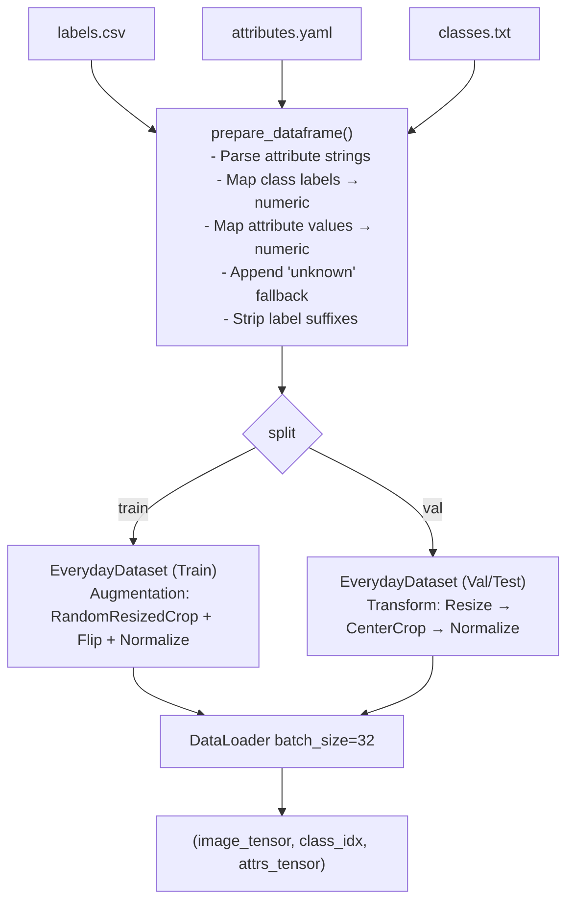
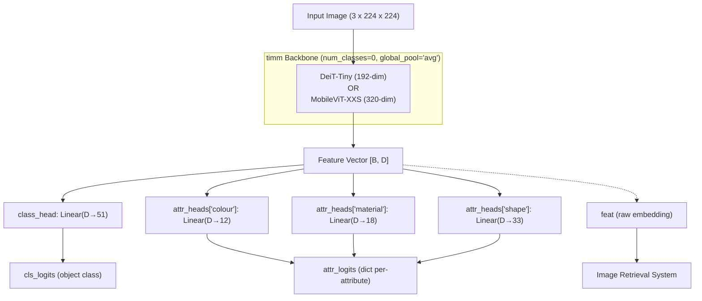
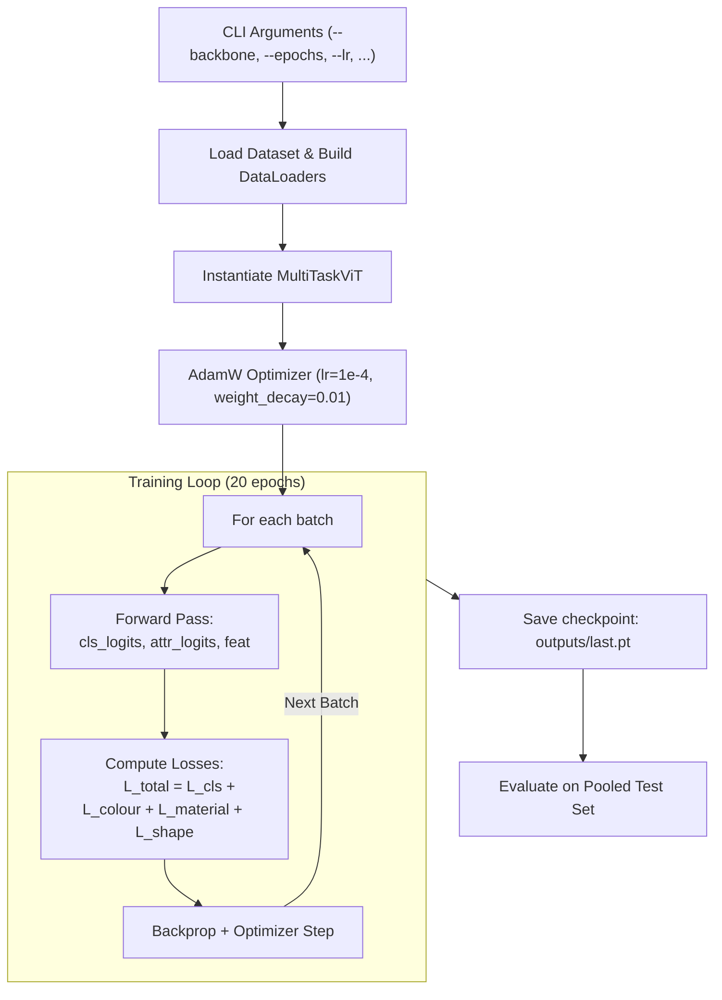
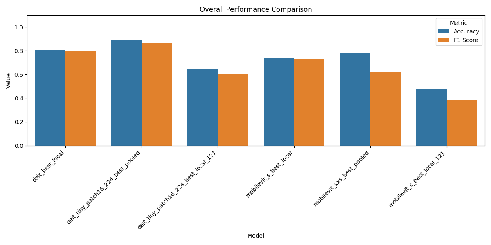
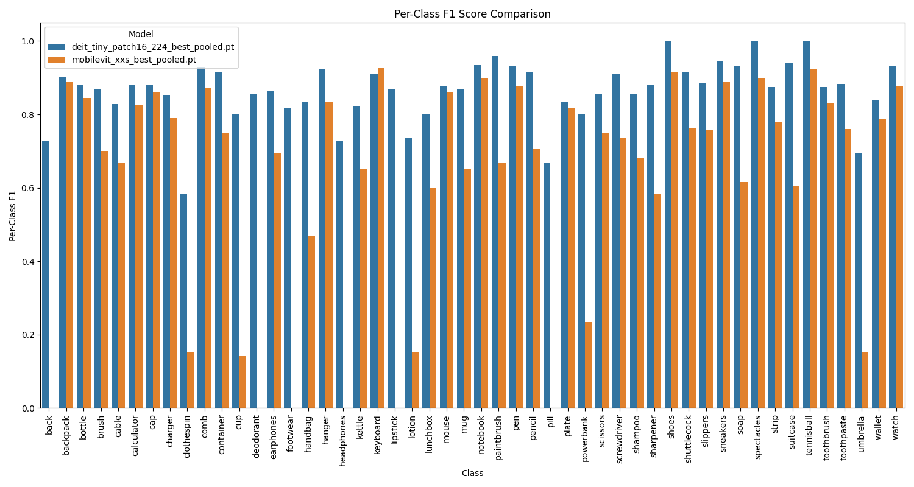

# Lightweight ViT Multi-Task Learning: DeiT-Tiny vs MobileViT-XXS

A benchmarking study comparing two lightweight Vision Transformer architectures — **DeiT-Tiny** and **MobileViT-XXS** — on a **Multi-Task Learning (MTL)** problem. Both models are evaluated on the **Everyday Object Catalog** dataset, where they must simultaneously classify object categories and predict fine-grained visual attributes such as color, material, and shape.

## 1. Project Overview

The motivation is practical. Deploying vision models on edge devices (phones, embedded systems) requires ultra-small models.
This project answers a practical question for edge AI deployment: **how much accuracy do you sacrifice by choosing a 4.4x smaller transformer?** Two architectures are compared head-to-head:

|                   |                     DeiT-Tiny                      |                 MobileViT-XXS                 |
| :---------------- | :------------------------------------------------: | :-------------------------------------------: |
| Full Name         |      Data-efficient Image Transformer (Tiny)       | Mobile Vision Transformer (Extra-Extra-Small) |
| Parameters        |                       ~5.7 M                       |                    ~1.3 M                     |
| Design Philosophy | Data-efficient training via knowledge distillation |     Mobile-first hybrid CNN + Transformer     |
| Origin Paper      |                Touvron et al., 2021                |            Mehta & Rastegari, 2021            |

Both backbones are loaded from the [`timm`](https://github.com/huggingface/pytorch-image-models) library and extended with custom multi-task heads to simultaneously produce:

- **Object class prediction** — 51 fine-grained object categories
- **Color prediction** — 12 color classes
- **Material prediction** — 18 material types
- **Shape/Condition prediction** — 33 shape categories

---

## 2. Dataset: Everyday Object Catalog

### 2.1 Overview

The **Everyday Object Catalog** is a custom multi-task learning dataset hosted on Kaggle, containing images of everyday household objects photographed against varied backgrounds.

| Property            | Value                                                                                     |
| :------------------ | :---------------------------------------------------------------------------------------- |
| Source              | [Everyday Object Catalog](https://www.kaggle.com/datasets/anat3l/everyday-object-catalog) |
| Evaluation Set Size | 2,234 images (pooled test split)                                                          |
| Object Classes      | 51 fine-grained categories                                                                |
| Attribute Tasks     | 3 (Color, Material, Shape)                                                                |
| Image Format        | RGB, resized to 224 x 224                                                                 |

### 2.2 Object Categories

The dataset spans 10 high-level category groups, broken into 51 fine-grained object classes:

|  #  | High-Level Category | Example Objects                         |
| :-: | :------------------ | :-------------------------------------- |
|  1  | Bathroom            | toothbrush, toothpaste, shampoo, lotion |
|  2  | Clothing            | cap, shoes, sneakers, slippers, wallet  |
|  3  | Electronics         | cable, charger, keyboard, headphones    |
|  4  | Food                | mug, plate, lunchbox, container         |
|  5  | Fruits              | —                                       |
|  6  | Furniture           | —                                       |
|  7  | Medical             | pill                                    |
|  8  | Sports              | tennisball                              |
|  9  | Stationary          | pen, pencil, notebook, sharpener, comb  |
| 10  | Tools               | scissors, screwdriver                   |

> **Note:** The `labels.csv` encodes fine-grained labels (e.g., `pen_blue`). The `prepare_dataframe()` function strips suffixes to canonicalize them, resulting in 51 unique evaluated classes — broader than the 10-class `classes.txt`.

### 2.3 Attribute Vocabulary

Each image carries three categorical attribute labels, which form the secondary prediction tasks:

| Attribute  | Cardinality | Example Values                                        |
| :--------- | :---------: | :---------------------------------------------------- |
| `colour`   |     12      | black, blue, white, multi-colored, silver, red, green |
| `material` |     18      | plastic, metal, glass, leather, rubber, paper, fabric |
| `shape`    |     33      | rectangular, cylindrical, oval, spherical, u-shaped   |

An `"unknown"` fallback class is appended to every attribute list at data-prep time to handle missing annotations gracefully.

### 2.4 Metadata Files

```
data/metadata/
├── labels.csv                        # Per-image rows: path, class, attributes, split
├── attributes.yaml                   # Canonical vocabulary for each attribute
├── classes.txt                       # Canonical class names (10 high-level)
├── Dataset_3attributes_clean.csv     # Cleaned full dataset (source for labels.csv)
└── merged_output.xlsx - Sheet1.csv   # Raw merged export from curation pipeline
```

### 2.5 Data Pipeline Flowchart



---

## 3. Architecture: MultiTaskViT

**File:** `src/models/multitask_vit.py`

The core class `MultiTaskViT` wraps `timm`-compatible backbone and attaches multiple linear classification heads — one for object classification and one per attribute.

### 3.1 Architecture Diagram



---

## 4. Training Pipeline

**File:** `src/training/train.py`

### 4.1 Pipeline Flowchart



### 4.2 Augmentation Strategy

| Stage          | Transforms Applied                                                            |
| :------------- | :---------------------------------------------------------------------------- |
| **Training**   | Resize → RandomResizedCrop (scale 0.7–1.0) → RandomHorizontalFlip → Normalize |
| **Validation** | Resize → CenterCrop → Normalize                                               |

### 4.3 Loss Function

The total loss is an unweighted sum of all task losses:

```
L_total = L_classification  +  L_colour  +  L_material  +  L_shape
```

All individual terms use `CrossEntropyLoss`.

### 4.4 Optimizer

| Setting         | Value |
| :-------------- | :---- |
| Optimizer       | AdamW |
| Learning Rate   | 1e-4  |
| Weight Decay    | 0.01  |
| Epochs          | 20    |
| Batch Size      | 32    |
| LR Scheduler    | None  |
| Mixed Precision | None  |

---

## 5. Results

### 5.1 Overall Performance (Pooled Test Set — 2,234 images)

| Model         | Object Accuracy | Object F1  | Parameters |
| :------------ | :-------------: | :--------: | :--------: |
| **DeiT-Tiny** |   **88.79%**    | **0.8645** |   ~5.7 M   |
| MobileViT-XXS |     77.83%      |   0.6171   |   ~1.3 M   |

**DeiT-Tiny wins** by a substantial margin: +11 percentage points in accuracy and +0.25 in F1-score.



### 5.2 Attribute Prediction

| Attribute           | DeiT-Tiny Acc | DeiT-Tiny F1 | MobileViT-XXS Acc | MobileViT-XXS F1 |
| :------------------ | :-----------: | :----------: | :---------------: | :--------------: |
| **Color**           |     75.2%     |    0.546     |       42.6%       |      0.121       |
| **Material**        |     80.8%     |    0.633     |       66.5%       |      0.269       |
| **Shape/Condition** |     76.8%     |    0.555     |       54.5%       |      0.231       |

> MobileViT-XXS attribute F1 scores (0.12–0.27) are severely depressed despite moderate accuracy — a hallmark of predicting dominant classes almost exclusively. This reveals underfitting on secondary tasks due to its capacity bottleneck.

### 5.3 Per-Class F1 Score Comparison



### 5.4 All Checkpoint Variants

| Checkpoint                             | Object Acc | Object F1  | Notes                          |
| :------------------------------------- | :--------: | :--------: | :----------------------------- |
| `deit_best_local`                      |   80.33%   |   0.8019   | Local (non-pooled) split       |
| `deit_tiny_patch16_224_best_pooled`    | **88.79%** | **0.8645** | Pooled — **main benchmark**    |
| `deit_tiny_patch16_224_best_local_121` |   64.18%   |   0.6009   | 121-class fine-grained variant |
| `mobilevit_s_best_local`               |   74.33%   |   0.7336   | Larger MobileViT-Small variant |
| `mobilevit_xxs_best_pooled`            |   77.83%   |   0.6171   | Pooled — **main benchmark**    |
| `mobilevit_s_best_local_121`           |   48.03%   |   0.3829   | 121-class fine-grained variant |

### 5.5 Per-Class Highlights (DeiT-Tiny)

**Best performing classes:**

| Class      |  F1  | Accuracy |
| :--------- | :--: | :------: |
| shoes      | 1.00 |   1.00   |
| spectacles | 1.00 |   1.00   |
| tennisball | 1.00 |   1.00   |
| paintbrush | 0.96 |   1.00   |
| sneakers   | 0.95 |   0.97   |

**Most challenging classes:**

| Class      | DeiT-Tiny F1 | MobileViT-XXS F1 |
| :--------- | :----------: | :--------------: |
| pill       |     0.67     |       0.00       |
| umbrella   |     0.70     |       0.00       |
| deodorant  |     0.86     |       0.00       |
| headphones |     0.73     |       0.00       |
| back       |     0.73     |       0.00       |

MobileViT-XXS records **zero F1** on several visually similar or rare classes — a clear sign of a capacity bottleneck preventing discrimination of fine-grained features.

### 5.6 Interactive Demo

Launch the Jupyter-based GUI demo:

```bash
jupyter notebook notebooks/inference_demo.ipynb
```

---

## 6. Key Findings

### DeiT-Tiny

- **DeiT-Tiny is a strong multi-task learner** at its scale. Achieving ~89% object accuracy and solid attribute prediction on a specialized, relatively small dataset is a strong result for a 5.7M parameter model.
- **Pooling the dataset matters significantly.** DeiT-Tiny jumped from 80.3% (local split) to 88.8% (pooled), confirming that training data volume has a large impact at this scale.

### MobileViT-XXS

- Its 1.3M parameters create a **capacity bottleneck** that prevents learning discriminative features for all 51 fine-grained object types simultaneously.
- Attribute F1 scores of 0.12–0.27 indicate it collapses to predicting dominant classes — a clear sign of **underfitting secondary tasks**.

---

## Dependencies

| Package                  | Role                         |
| :----------------------- | :--------------------------- |
| `torch` >= 2.0           | Core deep learning framework |
| `torchvision` >= 0.15    | Image transforms             |
| `timm` >= 0.9            | Pretrained ViT backbones     |
| `pandas`                 | Dataset tabular handling     |
| `Pillow`                 | Image loading                |
| `pyyaml`                 | Attribute vocabulary config  |
| `scikit-learn`           | Metrics (F1, accuracy)       |
| `matplotlib` + `seaborn` | Result visualization         |
| `tqdm`                   | Training progress bars       |
| `ipywidgets` + `ipython` | Jupyter demo GUI             |
